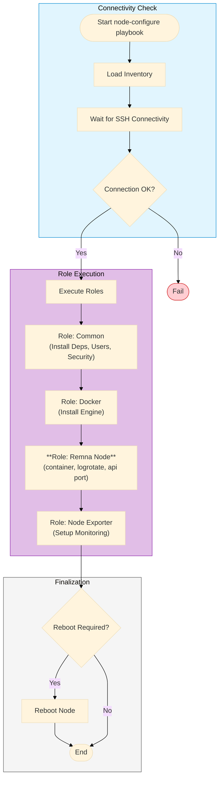

# Ansible Configuration Flow

```mermaid
---
config:
  theme: base
  layout: dagre
  flowchart:
    curve: monotoneY
    rankdir: TB
---
flowchart TB
    subgraph Connectivity["Connectivity Check"]
        direction TB
        Start([Start node-configure playbook]) --> Inventory[Load Inventory]
        Inventory --> WaitSSH[Wait for SSH Connectivity]
        
        WaitSSH --> Check{Connection OK?}
    end

    %% Error Handling
    Check -->|No| Fail([Fail])

    subgraph Provisioning["Role Execution"]
        direction TB
        Check -->|Yes| Roles[Execute Roles]
        Roles --> Common["Role: Common<br/>(Install Deps, Users, Security)"]
        Common --> Docker["Role: Docker<br/>(Install Engine)"]
        Docker --> App["**Role: Remna Node**<br/>(container, logrotate, api port)"]
        App --> Exporter["Role: Node Exporter<br/>(Setup Monitoring)"]
    end

    subgraph Finalization["Finalization"]
        direction TB
        Exporter --> RebootCheck{Reboot Required?}
        RebootCheck -->|Yes| Reboot[Reboot Node] --> End([End])
        RebootCheck -->|No| End
    end

    %% Styling
    style Connectivity fill:#E1F5FE,stroke:#0288D1
    style Provisioning fill:#E1BEE7,stroke:#8E24AA
    style Finalization fill:#F5F5F5,stroke:#616161
    style Fail fill:#FFCDD2,stroke:#D32F2F
```
