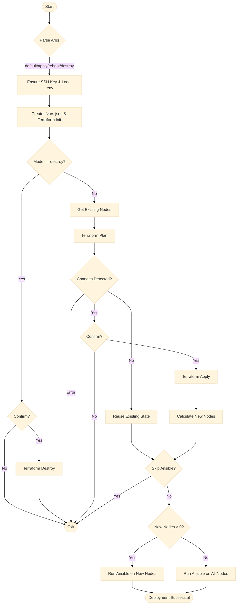

# Orchestration flow

```mermaid
---
config:
  theme: base
  layout: dagre
  flowchart:
    curve: monotoneY
    rankdir: TB
---
flowchart TB

        Start([Start]) --> Args{Parse Args}
        Args -->|default/apply/reboot/destroy| Init[Ensure SSH Key & Load .env]
        Init --> TFVars[Create tfvars.json & Terraform Init]

        TFVars --> ModeCheck{Mode == destroy?}
        ModeCheck -->|Yes| ConfirmDestroy{Confirm?}
        ConfirmDestroy -->|No| Exit([Exit])
        ConfirmDestroy -->|Yes| TFDestroy[Terraform Destroy] --> Exit

        ModeCheck -->|No| GetState[Get Existing Nodes]
        GetState --> TFPlan[Terraform Plan]
        TFPlan --> PlanCheck{Changes Detected?}
        
        PlanCheck -->|Error| Exit
        PlanCheck -->|No| CalcNodes[Reuse Existing State]
        PlanCheck -->|Yes| ConfirmApply{Confirm?}
        ConfirmApply -->|No| Exit
        ConfirmApply -->|Yes| TFApply[Terraform Apply] --> CalcNew[Calculate New Nodes]


        CalcNodes --> SkipAnsible{Skip Ansible?}
        CalcNew --> SkipAnsible

        SkipAnsible -->|Yes| Exit
        SkipAnsible -->|No| AnsibleTarget{New Nodes > 0?}
        
        AnsibleTarget -->|Yes| RunAnsibleNew[Run Ansible on New Nodes]
        AnsibleTarget -->|No| RunAnsibleAll[Run Ansible on All Nodes]
        
        RunAnsibleNew --> Success([Deployment Successful])
        RunAnsibleAll --> Success


```
