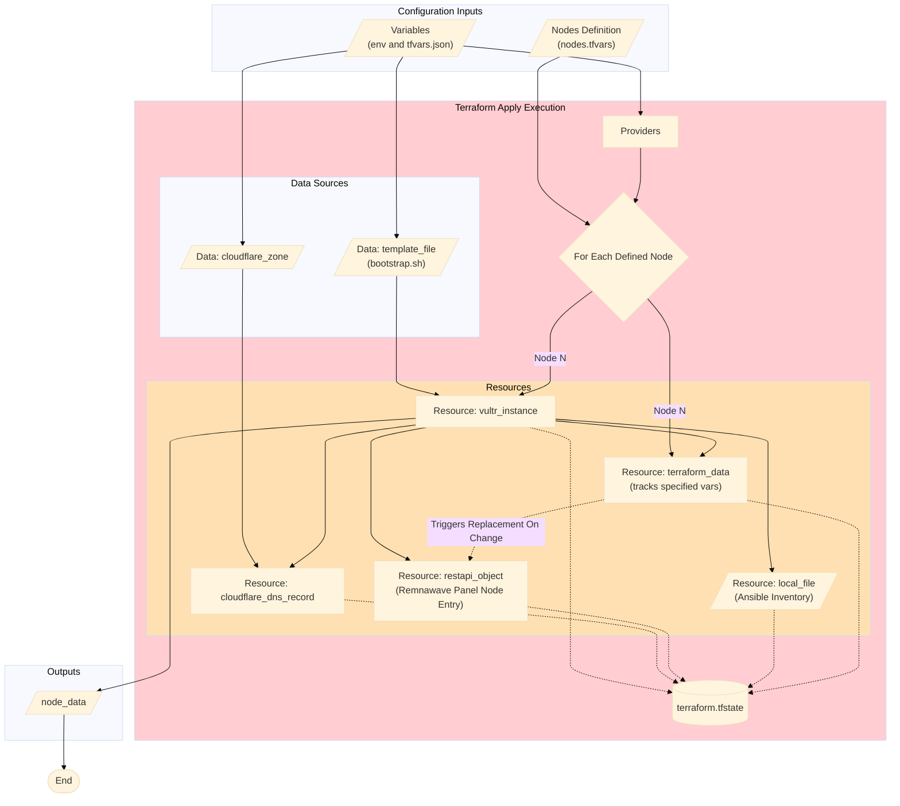

# Terraform Provisioning Flow

```mermaid
---
config:
  theme: base
  layout: dagre
  flowchart:
    curve: monotoneY 
    rankdir: TB
---
flowchart TB
 subgraph Inputs_Layer["Configuration Inputs"]
    direction TB
        EnvVars[/"Variables<br>(env and tfvars.json)<br>"/]
        TFVars[/"Nodes Definition<br>(nodes.tfvars)"/]
  end

 subgraph Core_Execution["Terraform Apply Execution"]
    direction TB
        ProviderConfig["Providers"]

        subgraph Data_Layer["Data Sources"]
            Bootstrap[/"Data: template_file<br>(bootstrap.sh)"/]
            CFZone[/"Data: cloudflare_zone"/]
        end
        
        Parallel_Provisioning{"For Each Defined Node"}

        subgraph Resources_Layer["Resources"]
            VultrN["Resource: vultr_instance<br>"]
            DNS["Resource: cloudflare_dns_record"]
            ConfigHash["Resource: terraform_data<br>(tracks specified vars)"]
            Panel["Resource: restapi_object<br>(Remnawave Panel Node Entry)"]
            InventoryFile[/"Resource: local_file<br>(Ansible Inventory)"/]
        end

        State[("terraform.tfstate<br>")]
  end

 subgraph Artifacts["Outputs"]
        FinalOutputs[/"node_data"/]
  end

    EnvVars --> ProviderConfig & Bootstrap & CFZone 
    TFVars --> Parallel_Provisioning 
    Bootstrap --> VultrN
    CFZone --> DNS
    ProviderConfig --> Parallel_Provisioning
    Parallel_Provisioning -- Node N --> VultrN
    Parallel_Provisioning -- Node N --> ConfigHash
    VultrN --> DNS & Panel & InventoryFile & ConfigHash & FinalOutputs
    ConfigHash -. Triggers Replacement On Change .-> Panel
    ConfigHash ~~~ DNS & InventoryFile
    VultrN -.-> State
    DNS -.-> State
    Panel -.-> State
    InventoryFile -.-> State
    ConfigHash -.-> State
    FinalOutputs --> End(["End"])
    
    %% Force Outputs Lower
    DNS & Panel & InventoryFile ~~~ FinalOutputs

    style Resources_Layer fill:#FFE0B2
    style Core_Execution fill:#FFCDD2
```
